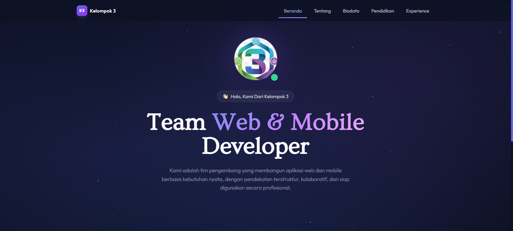
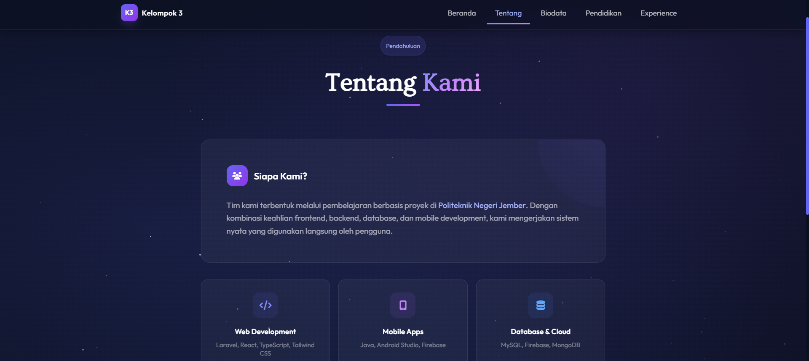
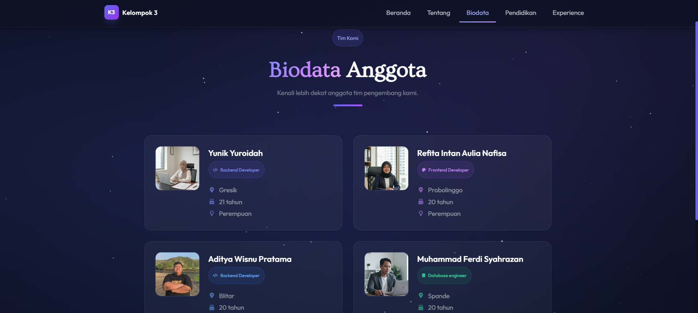
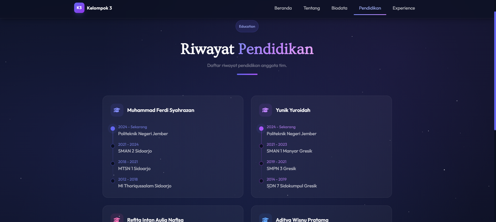

# Kelompok 3 — Team Portfolio

Simple Laravel-based team portfolio and demo CRUD (session-backed) for the Kelompok 3 project. This repository contains a multi-page site built with Blade + Tailwind CSS and small session-based CRUD logic (no database required) for managing member achievements during demos.

## Features

- Multi-page Blade views: `home`, `about`, `biodata`, `pendidikan`, `experience`.
- Session-based CRUD for `Prestasi` (add / edit / delete) per member — routes under `/experience`.
- Modern UI: dark theme, glassmorphism cards, animations, and responsive layout (Tailwind CSS).

## Quick setup (development)

1. Install PHP & Composer, Node.js & npm.
2. Install PHP dependencies:

```bash
composer install
```

3. Copy environment file and generate app key:

```bash
cp .env.example .env
php artisan key:generate
```

4. Recommended `.env` adjustments for demo (avoid DB requirement):

```
SESSION_DRIVER=file
CACHE_DRIVER=file
QUEUE_CONNECTION=sync
# leave DB connection as-is if you don't use it
```

5. Install frontend deps and build assets (optional if `public/output.css` already present):

```bash
npm install
npm run build   # or `npm run dev` for development
```

6. Serve locally:

```bash
php artisan serve --host=127.0.0.1 --port=8000
# then open http://127.0.0.1:8000
```

## Important routes / behavior

- `GET /` — Home
- `GET /about` — About
- `GET /biodata` — Team bios
- `GET /pendidikan` — Education
- `GET /experience` — Experience & Prestasi (main interactive page)

Session-based CRUD endpoints (no DB):

- `POST /experience/{member}/add` — add a new prestasi (field `text`)
- `POST /experience/{member}/update/{index}` — update existing item at `index`
- `POST /experience/{member}/delete/{index}` — delete item at `index`

These routes are implemented in `routes/web.php` and store lists in session keys like `prestasi_yunik`.

## Notes & caveats

- Data is stored in the user's session — it's temporary and per-browser. For production persistence, migrate to a database and store items with unique IDs.
- Update/delete operations use array indices; migrating to DB should use stable identifiers to avoid index-shift issues.
- Forms include `@csrf` tokens and server-side validation for basic safety.

## Assets

- Images and icons are in `public/assets/`.
- Tailwind custom styles are in `public/output.css` / `public/input.css` (project includes compiled CSS already).

## Dokumentasi Screenshot

| Beranda | Pendahuluan |
| --- | --- |
|  |  |

| Biodata | Pendidikan |
| --- | --- |
|  |  |

## Contributing

Feel free to open PRs. For production-readiness: add DB persistence, authentication, and tests.

---
Made for presentation and demo use by Kelompok 3.
